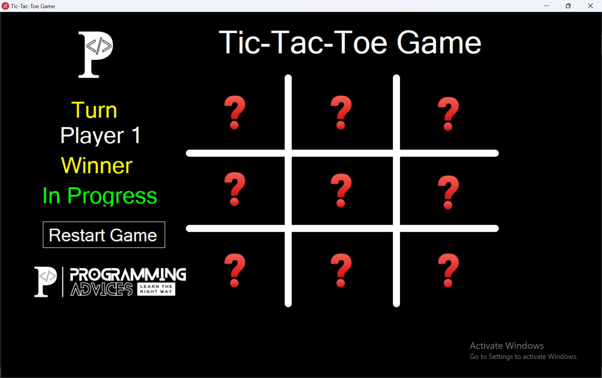
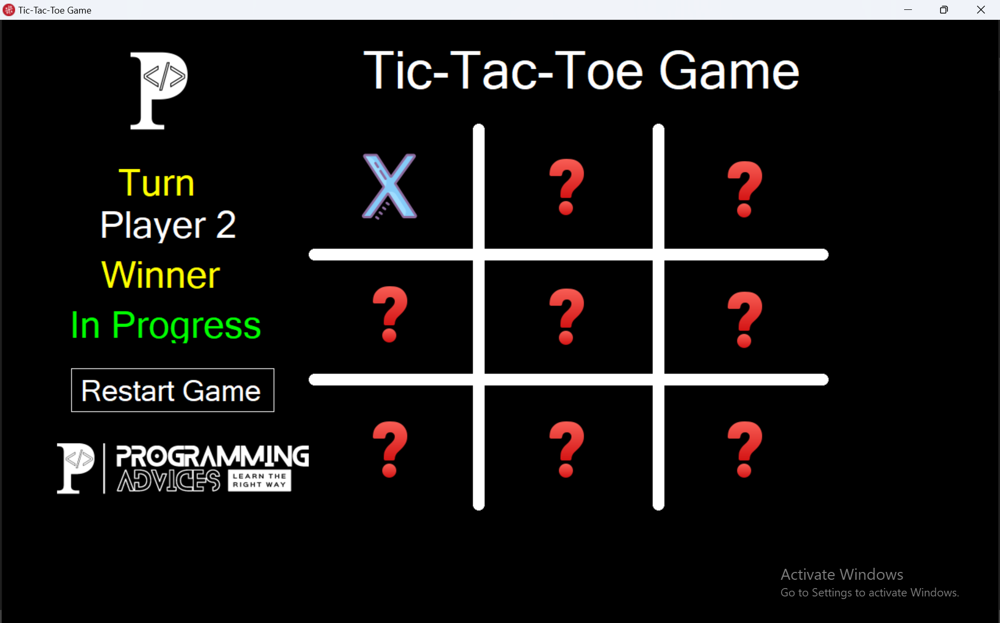
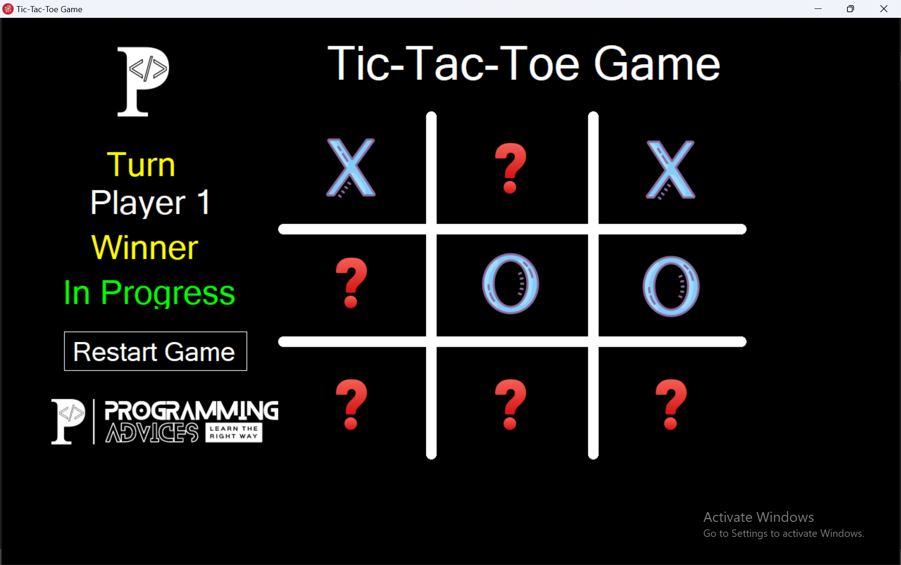
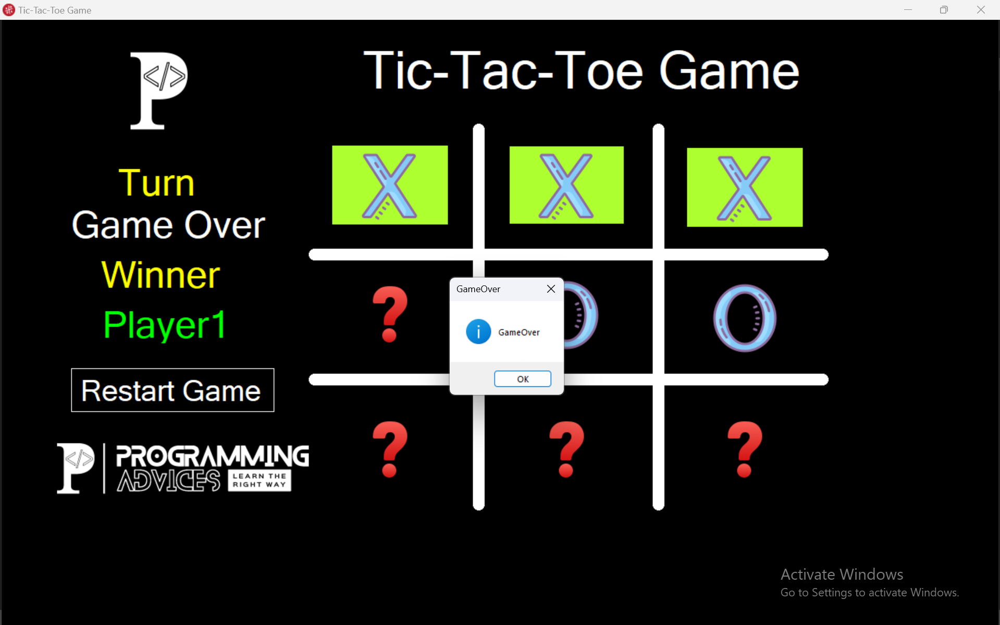

# Tic Tac Toe (XO Game)
A Windows Forms application in C# for a classic two-player Tic Tac Toe game.

---

## 📌 Description
A two-player X/O game with win, draw, and turn detection, a custom-drawn grid, and a restart option, built to practice OOP and event-driven programming in C#.

---

## 🛠️ Technologies
- C#
- Windows Forms (WinForms)
- .NET Framework
- OOP

---

## 🎯 Features
- Two-player turn-based gameplay
- Win detection (rows, columns, diagonals)
- Draw detection
- Custom-drawn grid using GDI+
- Restart game option

---

## 📷 Preview

  
  

  
  

---

## ✍️ Author
Hazem Ahmad Hazem  
- GitHub: https://github.com/HazemAhmadHaz
- LinkedIn: https://www.linkedin.com/in/hazem-ahmad-haz
- Email: HazemAhmad01234@gmail.com
